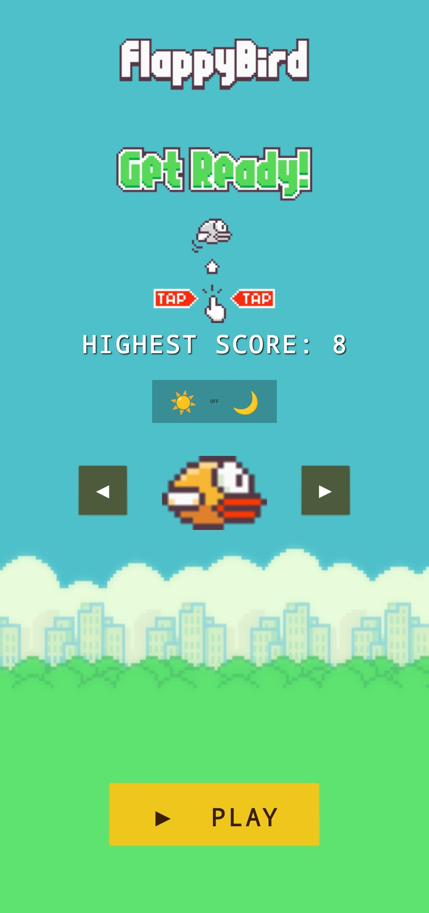
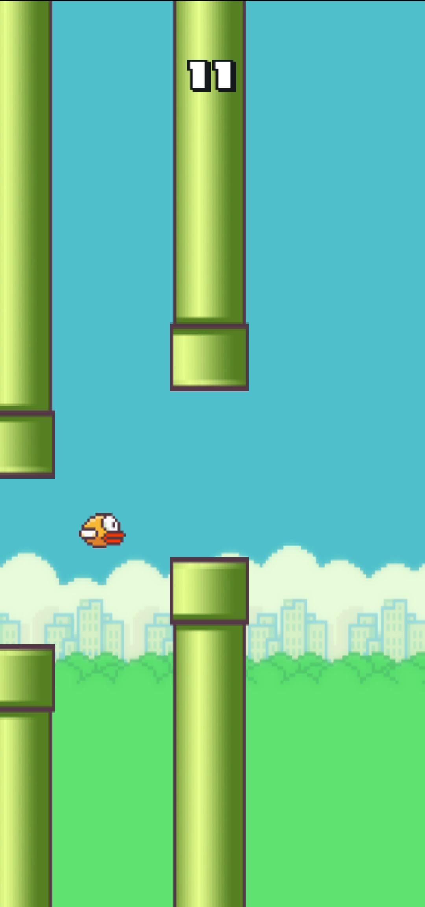
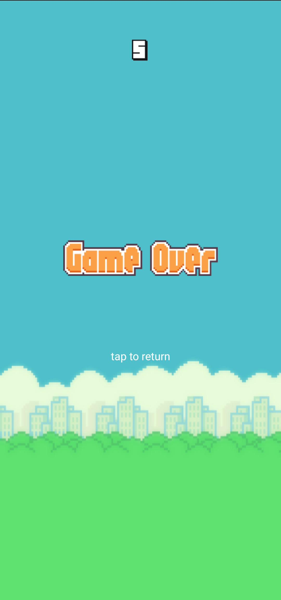

# Flappy Bird

A recreation of the classic Flappy Bird built in Java for Android.

**Download:** Available in the Releases section.

## Gameplay

Navigate through an endless series of pipes by tapping to keep the bird airborne. The game ends when the bird collides with a pipe, the ground, or the ceiling.

## Features

- Classic Flappy Bird gameplay
- Yellow, Blue, and Red bird selection
- Day and Night themes
- Animated bird sprites
- Persistent high score tracking
- Sound effects
- Random pipe color variations
- Fair obstacle balancing system

## Screenshots

  
  
  

## Built With

- Java
- Android SDK
- Canvas API
- SoundPool
- SharedPreferences