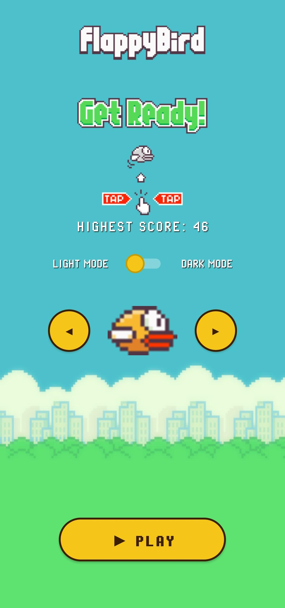
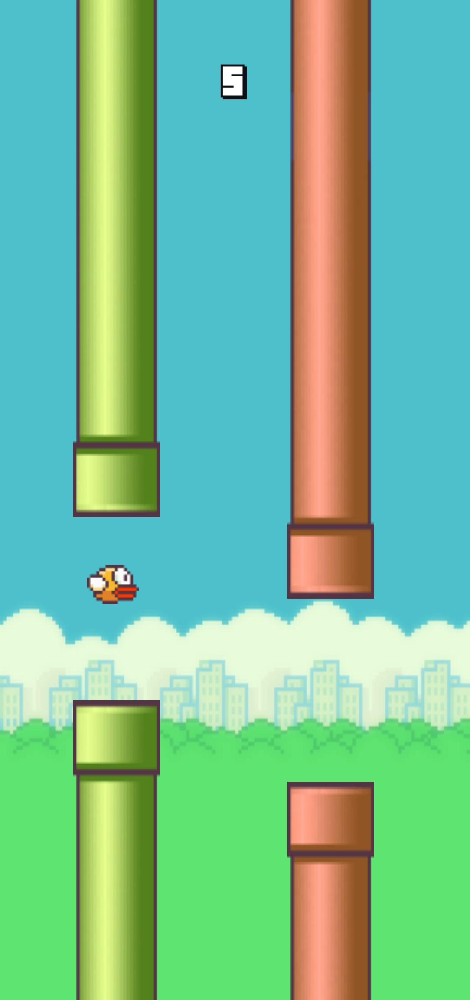
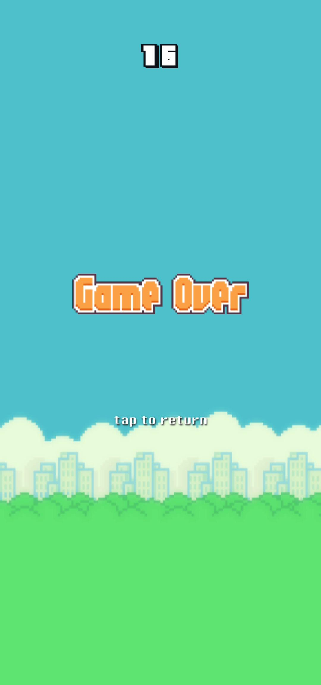

# Flappy Bird

A high-performance, custom-built arcade experience for Android. This project was engineered from the ground up using the Android Canvas API to deliver a responsive, retro-style gaming experience.

## Download

  

## Gameplay

## Technical Features

### 🎮 Core Gameplay Engine
* **High-Performance Loop:** Engineered a dedicated 50 FPS game loop using `Handler` and `Runnable` for smooth, low-latency performance[cite: 7].
* **Physics Simulation:** Custom gravity (`GRAVITY = 2`) and velocity calculations to replicate the classic "floaty" yet challenging flight mechanics[cite: 7].
* **Infinite World Generation:** Implemented a procedural pipe-recycling system that dynamically shifts obstacle height and spacing to ensure fair, infinite gameplay[cite: 7].
* **Collision Detection:** Precision-based bounding box intersections (`Rect.intersects`) between the bird and pipe entities to provide accurate failure states[cite: 7].

### 🎨 Graphics & Rendering
* **Canvas API Pipeline:** Manual frame-by-frame rendering using a custom `View` class, bypassing standard UI layouts for optimal performance[cite: 7].
* **Dynamic Scaling Engine:** Real-time bitmap resizing during `onSizeChanged` to ensure visual consistency across various device screen resolutions[cite: 7].
* **Asset Management:** Programmatic loading and manipulation of custom pixel-art sprites, including dynamic color variations for pipes[cite: 7].

### 🛠 UI & User Experience
* **Thematic Customization:** Persistent user settings using `SharedPreferences`, allowing for instant switching between Day and Night environmental themes[cite: 7].
* **Character Selection:** A custom-built carousel navigation system enabling players to choose between unique bird character assets[cite: 7].
* **Retro Typography:** Integration of custom pixeloperatorbold fonts with programmatic shadow-layering to maintain a clean 8-bit visual aesthetic[cite: 7].

### 🔊 Audio & Feedback
* **Asynchronous Audio Engine:** Built a custom `SoundPool` manager that pre-loads uncompressed audio vectors (wing, point, hit, die, swoosh), ensuring instant feedback[cite: 7].

## Built With
* **Language:** Java
* **Framework:** Android SDK (Canvas API)
* **Audio:** SoundPool (low-latency audio handling)
* **Data:** SharedPreferences (persistent state & high score tracking)

## Screenshots

  
  
  

